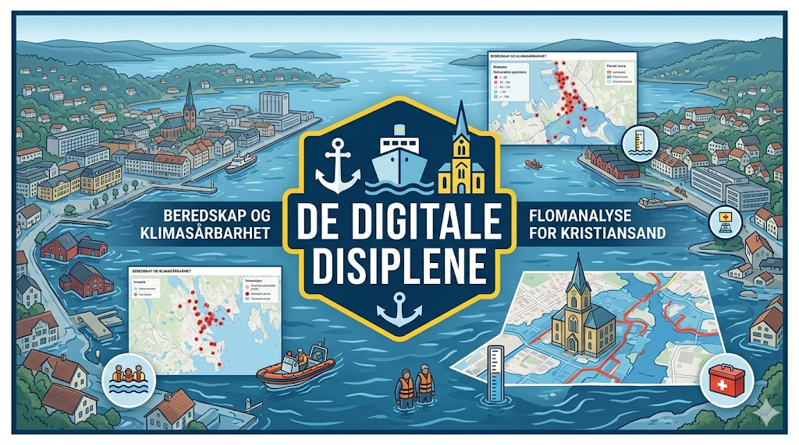

# 🛡️ Beredskap Agder

### _Smartere beredskap gjennom interaktiv klimaanalyse_

## 🎯 Pitch: Hvorfor, Hva og Hvordan?

### **Hvorfor? (Problemet)**

Klimaendringene øker risikoen for ekstreme flomhendelser og havnivåstigning i Kristiansand. Under en krisesituasjon er tilgang til tilfluktsrom og beredskapsressurser kritisk. Men hva skjer når selve tryggheten – tilfluktsrommene – blir rammet av flommen?

### **Hva? (Løsningen)**

Vi har utviklet en interaktiv web-portal som kombinerer sanntidsdata fra **Supabase** med avansert **geografisk analyse**. Kartet gir beredskapsledelsen full oversikt over:

- **Offentlige tilfluktsrom** og deres kapasitet.
- **Sårbarhetsanalyse:** Identifisering av rom som settes ut av spill ved en 200-årsflom.
- **Ressurskartlegging:** Nærmeste apotek, matbutikker og beredskapslagre.

### **Hvordan? (Teknologien)**

- **Analyse:** Vi har brukt **Python og GeoPandas** for å utføre en "Spatial Join" mellom flomsoner (NVE) og tilfluktsrom (DSB).
- **Resultat:** Analysen avdekket at **150 tilfluktsplasser** går tapt i Kristiansand ved en 200-årsflom.
- **Frontend:** Visualisert med **MapLibre GL JS** for sømløs ytelse.
- **Backend:** Data håndteres via en **PostgreSQL-database (Supabase)**.

---

## 📸 Demo

---

## 🛠️ Teknisk Oppsett

Prosjektet er bygget modulært for enkel utvidelse:

- `layers.js`: Håndterer kartografi og datakilder (WMS, GeoJSON, API).
- `klimaanalyse.ipynb`: Inneholder den reproduserbare Python-koden for analysen.
- `ui.js`: Styrer interaksjoner og dynamisk statistikk.

---

## 👥 Gruppen bak prosjektet

_Laget som en del av IS-218 ved Universitetet i Agder._
