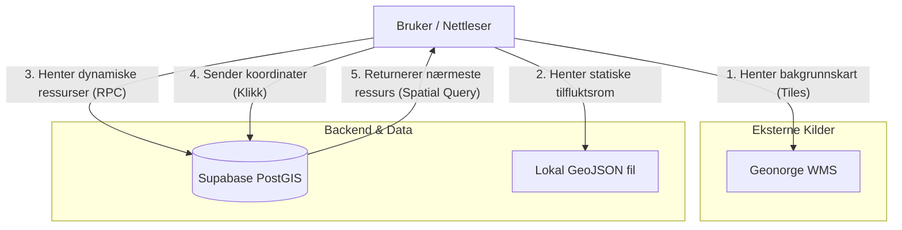

# Beredskapskart for Kristiansand 🚨

### TL;DR

Dette er en interaktiv kartløsning utviklet for å gi innbyggere i Kristiansand oversikt over kritisk infrastruktur som tilfluktsrom og beredskapsressurser. Applikasjonen lar brukere filtrere kartlag, finne sin egen posisjon, og utføre romlige søk for å lokalisere nærmeste nødressurs ved en hendelse.

### Demo av systemet

[Klikk her for å se demo av systemet](Demo.mp4)

### Teknisk Stack

Prosjektet er bygget som en modulær frontend-applikasjon uten byggsteg (Vanilla JS + ES Modules).

- **Kartbibliotek:** MapLibre GL JS (v4.7.1)
- **Database & Backend:** Supabase (PostgreSQL med PostGIS-utvidelse)
- **Klient:** Supabase JS Client (v2)
- **GIS-verktøy:** QGIS 3.40 (for dataprosessering)
- **Språk:** JavaScript (ES6 Modules), CSS3, HTML5

### Datakatalog

| Datasett                    | Kilde                   | Format              | Bearbeiding                                                                                                                                                                       |
| :-------------------------- | :---------------------- | :------------------ | :-------------------------------------------------------------------------------------------------------------------------------------------------------------------------------- |
| **Offentlige tilfluktsrom** | DSB / Geonorge          | GeoJSON             | Lastet ned rådata for hele Norge. Filtrert ut Kristiansand kommune i QGIS. Transformert koordinatsystem fra UTM33 til WGS84 (EPSG:4326) og eksportert som `tilfluktsrom.geojson`. |
| **Beredskapsressurser**     | Egendefinert (Supabase) | PostGIS (Geography) | Lagret i skybasert SQL-database. Hentes dynamisk via RPC-kall (`get_all_ressurser`). Inneholder punkter som hjertestartere og samlingsplasser.                                    |
| **Bakgrunnskart**           | Kartverket / Geonorge   | WMS (Raster)        | Hentes direkte fra Geonorge sin WMS-tjeneste ("Topografisk norgeskart gråtone") for å gi nøytral bakgrunn med god kontrast.                                                       |

### Arkitekturskisse

Slik flyter dataene gjennom applikasjonen:

### Refleksjon og forbedringspunkter

Her er noen forbedringspunkter ved den nåværende løsningen som vi tenkte var mest relevante:

1. **Sikkerhet:** API-nøkkelen til Supabase ligger åpent i koden (config.js). Selv om dette er en "anon"-nøkkel, burde applikasjonen ideelt sett hatt strengere Row Level Security (RLS) policies, eller brukt en proxy-server for å skjule nøklene.
2. **Ytelse ved skalering:** tilfluktsrom.geojson lastes i sin helhet inn i nettleserens minne. Hvis vi skulle dekket hele Norge, ville filen blitt for tung. Da burde dataene enten ligget i databasen eller blitt servert som Vector Tiles (MVT).
3. **Offline-støtte:** I en reell krisesituasjon kan internett være nede. Applikasjonen burde vært en Progressive Web App (PWA) som cachet kartdata og statiske filer for offline bruk.
4. **Oppdatering av data:** Tilfluktsrom-dataene er nå en statisk fil. En bedre løsning ville vært å hente disse direkte fra Geonorge sitt API for å alltid ha oppdaterte data.
